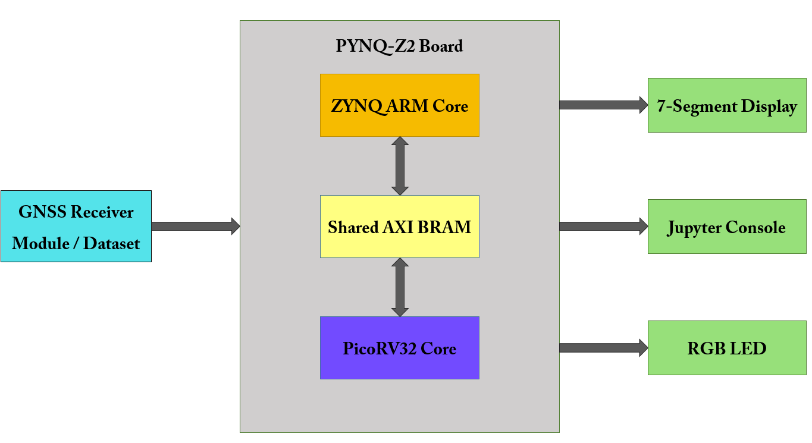
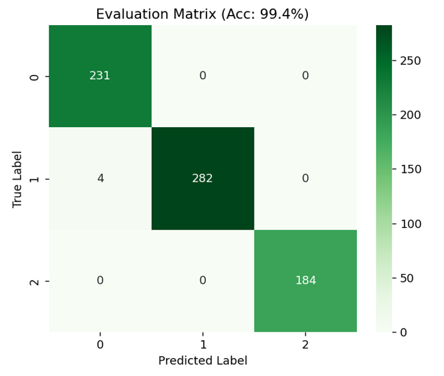
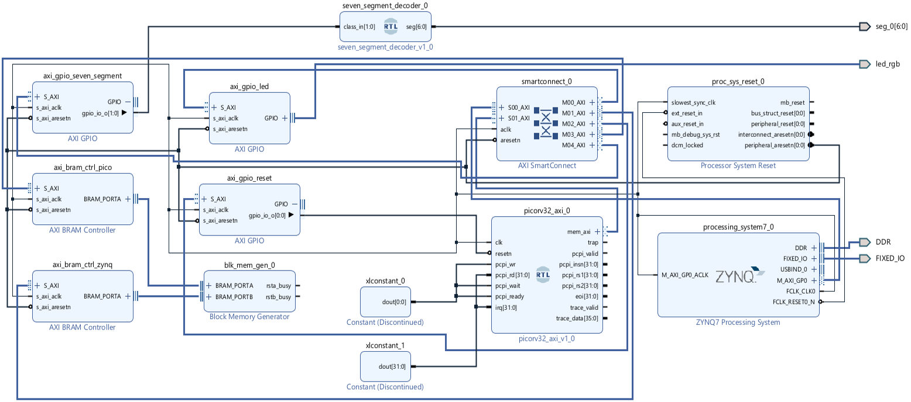
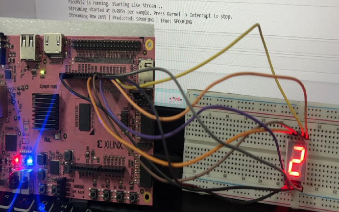

# GNSS Spoofing and Jamming Detector using RISC-V

A lightweight real-time GNSS spoofing and jamming detection system using Machine Learning, a RISC-V soft-core processor, and FPGA-based implementation.

The system uses a Support Vector Machine (SVM) classifier to distinguish between normal GNSS operation, spoofing attacks, and jamming attacks. The trained model is deployed on a RISC-V soft-core processor implemented on an FPGA, providing a hardware-software co-design approach for real-time GNSS threat detection.

## Table of Contents

- [Features](#features)
- [System Architecture](#system-architecture)
- [Hardware Used](#hardware-used)
- [Software](#software)
- [Working Principle](#working-principle)
- [Repository Structure](#repository-structure)
- [Usage](#usage)
- [Results](#results)
- [Demonstration](#demonstration)

## Features

- GNSS spoofing detection
- GNSS jamming detection
- Machine Learning-based classification using SVM
- RISC-V soft-core processor implementation
- FPGA-based embedded deployment
- Python-based model training and preprocessing
- Lightweight classifier suitable for embedded systems
- Real-time classification of GNSS conditions
- Hardware-software co-design

## System Architecture

The overall system consists of a machine-learning development stage followed by deployment of the trained classifier on a RISC-V processor implemented on FPGA.

The general workflow is:

**GNSS Data → Feature Processing → SVM Training → Model Parameter Extraction → RISC-V Firmware → FPGA Implementation → Threat Classification**

<!-- Replace the filename below with your actual image filename -->


## Hardware Used

- FPGA development board
- RISC-V soft-core processor
- On-board LEDs / display for classification output
- Computer for model development and FPGA programming

## Software

- Python
- Scikit-learn
- NumPy
- Pandas
- C
- RISC-V toolchain
- Xilinx Vivado

## Working Principle

The project uses a Support Vector Machine classifier trained using GNSS-related features.

The system classifies the received data into different operating conditions such as:

- **Normal** – legitimate GNSS operation
- **Jamming** – interference affecting GNSS reception
- **Spoofing** – manipulated GNSS signals intended to produce incorrect navigation information

The SVM model is initially developed and trained using Python. The trained model parameters are then adapted for embedded inference and implemented in firmware running on the RISC-V soft-core processor.

The RISC-V processor is synthesized on the FPGA using Xilinx Vivado, allowing the classification algorithm to operate as an embedded hardware-software system.

## Repository Structure

```text
GNSS-Spoofing-Jamming-Detector-RISCV/
│
├── Dataset/
│   └── Dataset files used for model development
│
├── Demo/
│   └── Project demonstration
│
├── Docs/
│   └── Project report and documentation
│
├── Firmware/
│   └── RISC-V firmware and embedded C files
│
├── Images/
│   └── Architecture, results and hardware images
│
├── Python/
│   └── Python scripts for preprocessing and SVM development
│
├── Vivado/
│   └── FPGA design, constraints and block-design files
│
└── README.md
```

## Usage

1. Prepare the GNSS dataset and required features.
2. Run the Python scripts to preprocess the data and train the SVM classifier.
3. Extract the trained SVM parameters.
4. Convert the model parameters into a representation suitable for embedded inference.
5. Include the model parameters in the RISC-V firmware.
6. Open the FPGA design using Xilinx Vivado.
7. Generate the FPGA bitstream.
8. Program the FPGA development board.
9. Run the RISC-V firmware.
10. Provide the required input data and observe the detected GNSS condition.

## Results

The implemented system demonstrates the feasibility of deploying a lightweight machine-learning classifier on a RISC-V soft-core processor for GNSS security applications.

### Classification Results

<!-- Replace with your actual filename -->


### FPGA Implementation

<!-- Replace with your actual filename -->


### Hardware Setup

<!-- Replace with your actual filename -->


## Demonstration

A demonstration of the FPGA-based GNSS spoofing and jamming detection system is available in the `Demo` directory.

The demonstration shows the operation of the implemented system and the corresponding classification output.

---

## Project Documentation

Detailed information regarding the design, implementation, methodology and results is available in the project report inside the `Docs` directory.

## 👥 Project Team

- **Nikhil Vinod** — [GitHub](https://github.com/NikhilVinod25)
- **Pranav S** — [GitHub](https://github.com/PranavS003)
- **Vishnu S Nambiar** — [GitHub](https://github.com/Vishnu-S-Nambiar)

**Electronics and Communication Engineering**
